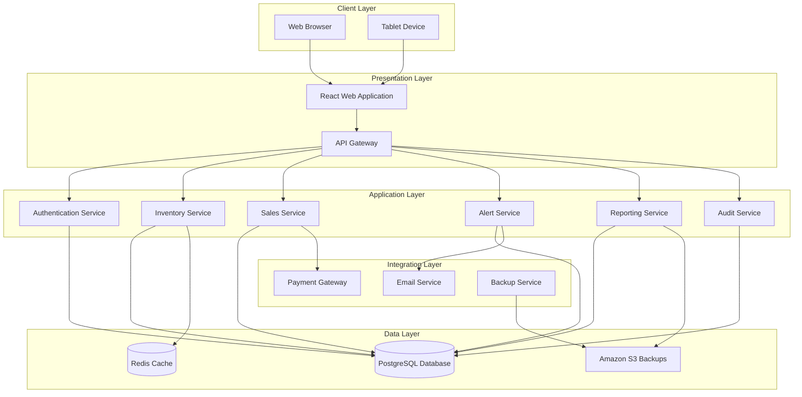
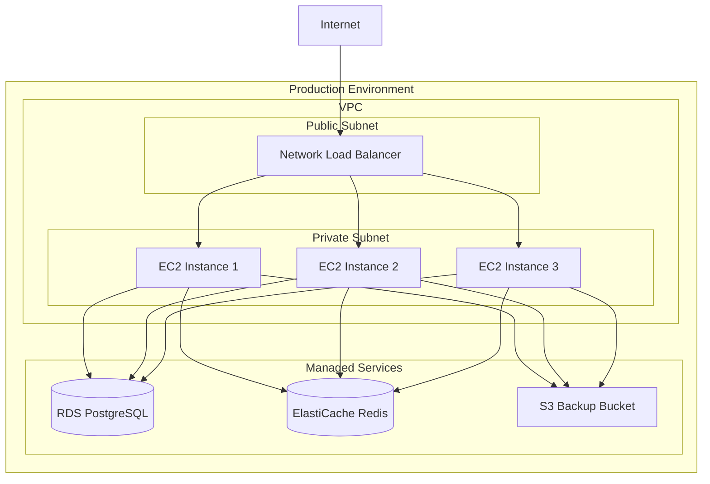
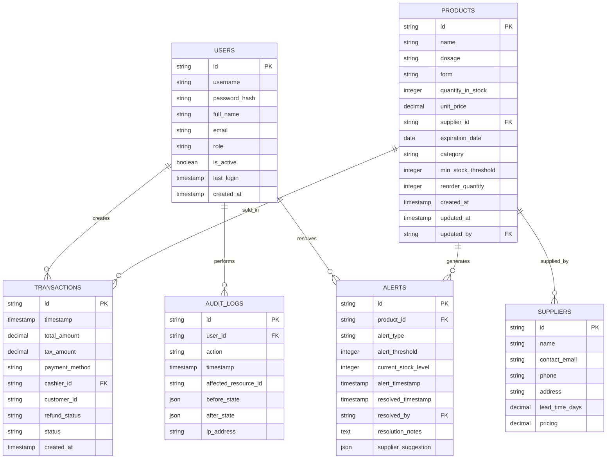
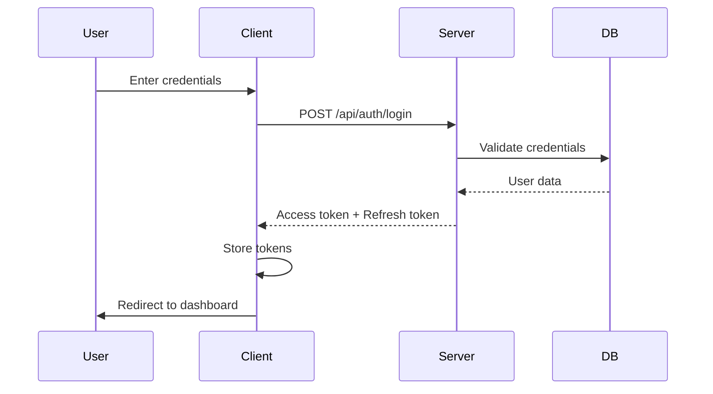
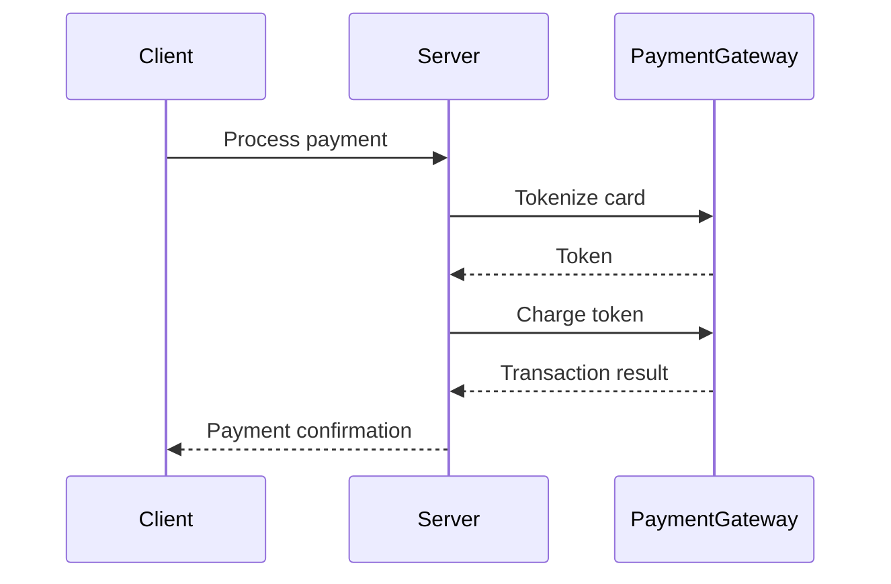

# Design Document: Nova Salud - Pharmacy Inventory and Sales Management System

## Overview

Nova Salud is a comprehensive pharmacy inventory and sales management system designed to centralize and automate pharmacy operations. The system provides real-time inventory tracking, automated sales processing, intelligent stock alerts, and role-based access control for pharmacy staff including managers, pharmacists, and cashiers.

This design document outlines the technical architecture, database schema, module design, security implementation, and integration points for the Nova Salud system.

## Architecture

### High-Level Architecture Diagram



### Technology Stack Recommendations

**Frontend Framework:**
- React 18+ with TypeScript for type safety
- Redux Toolkit for state management
- React Router for navigation
- Tailwind CSS for responsive styling
- Recharts for data visualization
- React Query for server state management

**Backend Framework:**
- Node.js with Express for REST API
- TypeScript for type safety
- JWT for authentication
- bcrypt for password hashing
- Winston for logging

**Database:**
- PostgreSQL 15+ for relational data
- Redis for caching and session management
- pgBouncer for connection pooling

**Infrastructure:**
- Docker for containerization
- Kubernetes for orchestration
- Nginx as reverse proxy
- Let's Encrypt for TLS certificates

**Deployment:**
- AWS ECS or EKS for container orchestration
- RDS for managed PostgreSQL
- ElastiCache for Redis
- S3 for backups and file storage
- CloudFront for CDN

### Deployment Architecture



## Components and Interfaces

### API Gateway

The API Gateway serves as the single entry point for all client requests, providing:

- Request routing to appropriate microservices
- Authentication and authorization validation
- Rate limiting and request throttling
- Request/response transformation
- Centralized logging and monitoring

### Core Services

**Inventory Service:**
- Product CRUD operations
- Stock level management
- Supplier management
- Expiration tracking
- Audit logging for inventory changes

**Sales Service:**
- Transaction creation and processing
- Payment processing integration
- Receipt generation
- Refund and void processing
- Sales data aggregation

**Alert Service:**
- Stock level monitoring
- Alert generation and management
- Alert notification
- Alert resolution tracking

**Reporting Service:**
- Report generation (daily sales, inventory status)
- Export functionality (PDF, CSV)
- Report scheduling
- Data aggregation and analysis

**Authentication Service:**
- User authentication
- Session management
- Password reset
- Role-based access control

**Audit Service:**
- Audit log creation
- Change tracking
- Security event logging

## Data Models

### Product Entity

```typescript
interface Product {
  id: string; // UUID
  name: string;
  dosage: string;
  form: string; // tablet, capsule, liquid, etc.
  quantityInStock: number;
  unitPrice: number;
  supplierId: string;
  expirationDate: Date;
  category: 'prescription' | 'otc' | 'general';
  minStockThreshold: number;
  reorderQuantity: number;
  createdAt: Date;
  updatedAt: Date;
  updatedAtBy: string; // user ID
}
```

### Transaction Entity

```typescript
interface Transaction {
  id: string; // UUID
  timestamp: Date;
  items: TransactionItem[];
  totalAmount: number;
  taxAmount: number;
  paymentMethod: 'cash' | 'credit' | 'insurance';
  cashierId: string;
  customerId?: string;
  refundStatus: 'none' | 'partial' | 'full';
  status: 'pending' | 'completed' | 'voided';
  createdAt: Date;
}
```

### User Entity

```typescript
interface User {
  id: string; // UUID
  username: string;
  passwordHash: string;
  fullName: string;
  email: string;
  role: 'admin' | 'pharmacist' | 'cashier';
  isActive: boolean;
  lastLogin: Date;
  createdAt: Date;
}
```

### Alert Entity

```typescript
interface Alert {
  id: string; // UUID
  productId: string;
  alertType: 'low_stock' | 'expiring_soon' | 'expired';
  alertThreshold: number;
  currentStockLevel: number;
  alertTimestamp: Date;
  resolvedTimestamp?: Date;
  resolvedBy?: string; // user ID
  resolutionNotes?: string;
  supplierSuggestion?: {
    supplierId: string;
    reason: 'best_price' | 'shortest_lead_time';
  };
}
```

### Audit Log Entity

```typescript
interface AuditLog {
  id: string; // UUID
  userId: string;
  action: string;
  timestamp: Date;
  affectedResourceId?: string;
  beforeState?: Record<string, any>;
  afterState?: Record<string, any>;
  ipAddress?: string;
}
```

## Database Design

### Entity-Relationship Diagram



### Database Schema

```sql
-- Users table
CREATE TABLE users (
    id UUID PRIMARY KEY DEFAULT gen_random_uuid(),
    username VARCHAR(50) UNIQUE NOT NULL,
    password_hash VARCHAR(255) NOT NULL,
    full_name VARCHAR(100) NOT NULL,
    email VARCHAR(100) UNIQUE NOT NULL,
    role VARCHAR(20) NOT NULL CHECK (role IN ('admin', 'pharmacist', 'cashier')),
    is_active BOOLEAN DEFAULT true,
    last_login TIMESTAMP,
    created_at TIMESTAMP DEFAULT CURRENT_TIMESTAMP
);

-- Suppliers table
CREATE TABLE suppliers (
    id UUID PRIMARY KEY DEFAULT gen_random_uuid(),
    name VARCHAR(100) NOT NULL,
    contact_email VARCHAR(100),
    phone VARCHAR(20),
    address TEXT,
    lead_time_days DECIMAL(5,2) DEFAULT 7.0,
    pricing JSONB,
    created_at TIMESTAMP DEFAULT CURRENT_TIMESTAMP
);

-- Products table
CREATE TABLE products (
    id UUID PRIMARY KEY DEFAULT gen_random_uuid(),
    name VARCHAR(200) NOT NULL,
    dosage VARCHAR(50),
    form VARCHAR(50) NOT NULL CHECK (form IN ('tablet', 'capsule', 'liquid', 'injection', 'cream', 'other')),
    quantity_in_stock INTEGER NOT NULL DEFAULT 0,
    unit_price DECIMAL(10,2) NOT NULL,
    supplier_id UUID REFERENCES suppliers(id),
    expiration_date DATE NOT NULL,
    category VARCHAR(20) NOT NULL CHECK (category IN ('prescription', 'otc', 'general')),
    min_stock_threshold INTEGER DEFAULT 10,
    reorder_quantity INTEGER DEFAULT 50,
    created_at TIMESTAMP DEFAULT CURRENT_TIMESTAMP,
    updated_at TIMESTAMP DEFAULT CURRENT_TIMESTAMP,
    updated_by UUID REFERENCES users(id)
);

-- Transactions table
CREATE TABLE transactions (
    id UUID PRIMARY KEY DEFAULT gen_random_uuid(),
    timestamp TIMESTAMP NOT NULL DEFAULT CURRENT_TIMESTAMP,
    total_amount DECIMAL(10,2) NOT NULL,
    tax_amount DECIMAL(10,2) NOT NULL DEFAULT 0.00,
    payment_method VARCHAR(20) NOT NULL CHECK (payment_method IN ('cash', 'credit', 'insurance')),
    cashier_id UUID NOT NULL REFERENCES users(id),
    customer_id UUID,
    refund_status VARCHAR(20) DEFAULT 'none' CHECK (refund_status IN ('none', 'partial', 'full')),
    status VARCHAR(20) DEFAULT 'completed' CHECK (status IN ('pending', 'completed', 'voided')),
    created_at TIMESTAMP DEFAULT CURRENT_TIMESTAMP
);

-- Transaction items table
CREATE TABLE transaction_items (
    id UUID PRIMARY KEY DEFAULT gen_random_uuid(),
    transaction_id UUID NOT NULL REFERENCES transactions(id) ON DELETE CASCADE,
    product_id UUID NOT NULL REFERENCES products(id),
    product_name VARCHAR(200) NOT NULL,
    quantity INTEGER NOT NULL,
    unit_price DECIMAL(10,2) NOT NULL,
    total_price DECIMAL(10,2) NOT NULL
);

-- Alerts table
CREATE TABLE alerts (
    id UUID PRIMARY KEY DEFAULT gen_random_uuid(),
    product_id UUID NOT NULL REFERENCES products(id),
    alert_type VARCHAR(20) NOT NULL CHECK (alert_type IN ('low_stock', 'expiring_soon', 'expired')),
    alert_threshold INTEGER NOT NULL,
    current_stock_level INTEGER NOT NULL,
    alert_timestamp TIMESTAMP NOT NULL DEFAULT CURRENT_TIMESTAMP,
    resolved_timestamp TIMESTAMP,
    resolved_by UUID REFERENCES users(id),
    resolution_notes TEXT,
    supplier_suggestion JSONB
);

-- Audit logs table
CREATE TABLE audit_logs (
    id UUID PRIMARY KEY DEFAULT gen_random_uuid(),
    user_id UUID NOT NULL REFERENCES users(id),
    action VARCHAR(100) NOT NULL,
    timestamp TIMESTAMP NOT NULL DEFAULT CURRENT_TIMESTAMP,
    affected_resource_id UUID,
    before_state JSONB,
    after_state JSONB,
    ip_address VARCHAR(45)
);

-- Session table
CREATE TABLE sessions (
    id UUID PRIMARY KEY DEFAULT gen_random_uuid(),
    user_id UUID NOT NULL REFERENCES users(id),
    token VARCHAR(500) NOT NULL,
    expires_at TIMESTAMP NOT NULL,
    created_at TIMESTAMP DEFAULT CURRENT_TIMESTAMP
);

-- Indexes for performance
CREATE INDEX idx_products_name ON products(name);
CREATE INDEX idx_products_supplier_id ON products(supplier_id);
CREATE INDEX idx_products_expiration_date ON products(expiration_date);
CREATE INDEX idx_products_quantity_in_stock ON products(quantity_in_stock);
CREATE INDEX idx_transactions_cashier_id ON transactions(cashier_id);
CREATE INDEX idx_transactions_timestamp ON transactions(timestamp);
CREATE INDEX idx_alerts_product_id ON alerts(product_id);
CREATE INDEX idx_alerts_alert_type ON alerts(alert_type);
CREATE INDEX idx_audit_logs_user_id ON audit_logs(user_id);
CREATE INDEX idx_audit_logs_timestamp ON audit_logs(timestamp);
CREATE INDEX idx_users_role ON users(role);
CREATE INDEX idx_users_username ON users(username);
```

### Indexing Strategy

**High-Priority Indexes:**
- `products(name)`: Frequent product searches
- `products(supplier_id)`: Supplier product lookups
- `products(expiration_date)`: Expiration tracking queries
- `products(quantity_in_stock)`: Low stock alert queries
- `transactions(cashier_id)`: Cashier transaction history
- `transactions(timestamp)`: Date range queries for reports
- `alerts(product_id)`: Product alert lookups
- `audit_logs(user_id, timestamp)`: Audit trail queries

**Covering Indexes:**
- Composite index on `products(name, dosage, form)` for comprehensive search
- Composite index on `transactions(timestamp, cashier_id)` for daily sales reports

## Correctness Properties

*A property is a characteristic or behavior that should hold true across all valid executions of a system-essentially, a formal statement about what the system should do. Properties serve as the bridge between human-readable specifications and machine-verifiable correctness guarantees.*

### Property 1: Product addition preserves unique identifiers

*For any* valid product data, when a product is added to the system, the system shall assign a unique identifier that does not conflict with any existing product identifier.

**Validates: Requirements FR-1.2**

### Property 2: Stock level updates are atomic

*For any* transaction processing, when items are added to a transaction, the stock level shall be decremented atomically, ensuring no negative stock levels occur even under concurrent transactions.

**Validates: Requirements FR-2.3**

### Property 3: Expiration warning accuracy

*For any* product with an expiration date within 90 days, the system shall display a warning indicator, and for products with expiration dates beyond 90 days, no warning shall be displayed.

**Validates: Requirements FR-1.5**

### Property 4: Low stock alert generation

*For any* product where the current stock level reaches or falls below the configured threshold, the system shall generate a low stock alert, and for products above the threshold, no alert shall be generated.

**Validates: Requirements FR-1.6, FR-3.2**

### Property 5: Transaction total calculation

*For any* transaction with items, the total amount shall equal the sum of (quantity × unit price) for all items plus tax, where tax is calculated at the configured tax rate.

**Validates: Requirements FR-2.4**

### Property 6: Stock validation during transactions

*For any* transaction attempt where the requested quantity exceeds available stock, the system shall display an error and prevent the addition of items that would result in negative stock.

**Validates: Requirements FR-2.8**

### Property 7: Role-based access control

*For any* user attempting to access a feature, the system shall allow access only if the user's role has the required permission, and shall deny access and display an appropriate error message otherwise.

**Validates: Requirements FR-5.7, NFR-2.1**

### Property 8: Audit log completeness

*For any* system action that modifies data, the system shall create an audit log entry containing the user identifier, action performed, timestamp, and affected resource identifier.

**Validates: Requirements FR-1.7, FR-6.4, FR-6.5**

### Property 9: Password storage security

*For any* user password, the system shall store only a bcrypt hash with sufficient work factor, and shall never store the plain text password or use reversible encryption.

**Validates: Requirements FR-6.2, NFR-2.2**

### Property 10: Session expiration

*For any* user session, after 30 minutes of inactivity, the system shall invalidate the session token and require re-authentication for subsequent requests.

**Validates: Requirements FR-5.6**

### Property 11: Alert resolution tracking

*For any* alert that is marked as resolved, the system shall record the resolution timestamp, the resolving user identifier, and any resolution notes provided.

**Validates: Requirements FR-3.5, FR-3.6**

### Property 12: Report export format integrity

*For any* report exported to PDF or CSV format, the exported data shall match the data displayed in the system for the same date range and filters.

**Validates: Requirements FR-4.6**

### Property 13: Transaction rollback on failure

*For any* transaction that fails mid-process, the system shall roll back all changes and restore the system to its state before the transaction began.

**Validates: Requirements NFR-4.2**

### Property 14: Backup integrity

*For any* scheduled backup, the system shall complete the backup without affecting user operations, and the backup shall be restorable to a consistent state.

**Validates: Requirements NFR-4.4**

## Error Handling

### Error Categories

**Validation Errors (400):**
- Invalid input data (missing required fields, invalid formats)
- Business rule violations (insufficient stock, expired product)
- Permission errors (insufficient role for action)

**Authentication Errors (401):**
- Invalid credentials
- Expired session tokens
- Missing authentication headers

**Authorization Errors (403):**
- Insufficient permissions for requested action
- Role-based access control violations

**Not Found Errors (404):**
- Requested resource does not exist
- Invalid resource identifiers

**Server Errors (500):**
- Database connection failures
- External service failures
- Unexpected exceptions

### Error Response Format

```json
{
  "error": {
    "code": "VALIDATION_ERROR",
    "message": "Product quantity must be greater than zero",
    "details": [
      {
        "field": "quantity",
        "message": "Quantity must be a positive integer"
      }
    ],
    "timestamp": "2024-01-15T10:30:00Z",
    "requestId": "req_1234567890abcdef"
  }
}
```

### Error Handling Strategy

**Client-Side:**
- Display user-friendly error messages
- Provide guidance on how to resolve common errors
- Implement retry logic for transient failures
- Show loading indicators for long-running operations

**Server-Side:**
- Log all errors with full context
- Implement circuit breakers for external services
- Use exponential backoff for retries
- Implement graceful degradation for non-critical features

## Testing Strategy

### Dual Testing Approach

**Unit Tests:**
- Verify specific examples and edge cases
- Test individual components in isolation
- Focus on boundary conditions and error scenarios
- Use Jest for testing framework

**Property-Based Tests:**
- Verify universal properties across all inputs
- Test with randomly generated data
- Cover comprehensive input coverage
- Use fast-check library for property-based testing

### Property-Based Testing Configuration

**Library Selection:**
- fast-check (JavaScript/TypeScript)
- Minimum 100 iterations per property test
- Seed-based reproducibility for failed tests

**Test Tagging Format:**
```typescript
// Feature: pharmacy-inventory-management, Property 1: Product addition preserves unique identifiers
```

### Test Coverage Requirements

**Unit Tests:**
- 80% code coverage minimum
- All public functions tested
- Edge cases and error conditions covered

**Property Tests:**
- All correctness properties implemented
- Each property tested with 100+ iterations
- Edge cases explicitly tested

### Integration Test Scenarios

1. **Inventory Management Flow:**
   - Add product → Modify product → View product history

2. **Sales Processing Flow:**
   - Start transaction → Add items → Process payment → Generate receipt

3. **Alert Generation Flow:**
   - Low stock → Alert generated → Alert viewed → Alert resolved

4. **Reporting Flow:**
   - Generate report → Export to PDF → Export to CSV

5. **Authentication Flow:**
   - Login → Session maintained → Logout → Re-authentication required

## API Design

### RESTful Endpoints

**Authentication:**
- `POST /api/auth/login` - Authenticate user
- `POST /api/auth/logout` - Logout user
- `POST /api/auth/refresh` - Refresh session token
- `POST /api/auth/password-reset` - Request password reset
- `POST /api/auth/password-reset/confirm` - Confirm password reset

**Users:**
- `GET /api/users` - List all users (Admin only)
- `POST /api/users` - Create user (Admin only)
- `GET /api/users/:id` - Get user details
- `PUT /api/users/:id` - Update user (Admin only)
- `DELETE /api/users/:id` - Deactivate user (Admin only)

**Products:**
- `GET /api/products` - List products with filters
- `POST /api/products` - Add product (Admin, Pharmacist)
- `GET /api/products/:id` - Get product details
- `PUT /api/products/:id` - Update product (Admin, Pharmacist)
- `DELETE /api/products/:id` - Delete product (Admin only)

**Transactions:**
- `POST /api/transactions` - Create new transaction
- `GET /api/transactions/:id` - Get transaction details
- `PUT /api/transactions/:id/void` - Void transaction (Cashier)
- `PUT /api/transactions/:id/refund` - Refund transaction (Cashier)

**Alerts:**
- `GET /api/alerts` - List alerts with filters
- `PUT /api/alerts/:id/resolve` - Resolve alert (Admin, Pharmacist)
- `GET /api/alerts/stats` - Get alert statistics

**Reports:**
- `GET /api/reports/sales` - Generate sales report
- `GET /api/reports/inventory` - Generate inventory report
- `GET /api/reports/export` - Export report (PDF, CSV)

**Audit Logs:**
- `GET /api/audit-logs` - List audit logs (Admin only)

### API Response Format

```json
{
  "data": {
    // Response data
  },
  "meta": {
    "page": 1,
    "limit": 20,
    "total": 100,
    "totalPages": 5
  }
}
```

## Interface Design

### User Interface Wireframes

**Dashboard (Role-specific):**
- Admin: System overview, recent alerts, quick actions
- Pharmacist: Medication overview, low stock items, recent transactions
- Cashier: Today's transactions, quick access to new transaction

**Inventory Management:**
- Product search and filtering
- Product list with stock levels
- Add/Edit product form
- Supplier management

**Sales Interface:**
- Transaction cart
- Product search
- Payment method selection
- Receipt display

**Alerts Dashboard:**
- Low stock alerts
- Expiring product alerts
- Alert resolution controls

**Reports:**
- Date range selector
- Report type selector
- Export options (PDF, CSV)
- Report preview

### Navigation Structure

```
Dashboard
├── Inventory Management
│   ├── Product List
│   ├── Add Product
│   ├── Edit Product
│   └── Supplier Management
├── Sales
│   ├── New Transaction
│   ├── Transaction History
│   └── Receipt Printer
├── Alerts
│   ├── Active Alerts
│   ├── Resolved Alerts
│   └── Alert Settings
├── Reports
│   ├── Sales Reports
│   ├── Inventory Reports
│   └── Export History
└── Admin
    ├── User Management
    ├── System Settings
    └── Audit Logs
```

### Responsive Design Considerations

**Desktop (1200px+):**
- Full sidebar navigation
- Multi-column layouts
- Advanced filtering options

**Tablet (768px - 1199px):**
- Collapsible sidebar
- Single-column layouts
- Simplified filtering

**Mobile (< 768px):**
- Bottom navigation bar
- Card-based layouts
- Touch-optimized controls

## Security Design

### Authentication Flow



### Authorization Implementation

**Role-Based Access Control (RBAC):**

```typescript
interface Permission {
  resource: string;
  actions: string[];
  roles: string[];
}

const permissions: Permission[] = [
  {
    resource: 'products',
    actions: ['read', 'create', 'update', 'delete'],
    roles: ['admin', 'pharmacist']
  },
  {
    resource: 'transactions',
    actions: ['read', 'create'],
    roles: ['admin', 'pharmacist', 'cashier']
  },
  {
    resource: 'users',
    actions: ['read', 'create', 'update', 'delete'],
    roles: ['admin']
  }
];
```

**Middleware Implementation:**
- Validate user authentication
- Check role permissions
- Log unauthorized access attempts

### Data Encryption Strategy

**In Transit:**
- TLS 1.3 for all communications
- HSTS headers for browser enforcement
- Certificate pinning for mobile clients

**At Rest:**
- PostgreSQL encryption at rest
- AES-256 for sensitive data fields
- Key management via AWS KMS

### Session Management

**Token Structure:**
```json
{
  "userId": "uuid",
  "role": "admin",
  "iat": 1642200000,
  "exp": 1642210800
}
```

**Session Policies:**
- Access token: 30 minutes
- Refresh token: 7 days
- Automatic token refresh before expiration
- Session invalidation on logout

## Alert System Design

### Low Stock Alert Logic

```typescript
function checkStockLevels() {
  const products = db.products.find({
    quantityInStock: { $lte: minStockThreshold }
  });

  for (const product of products) {
    const alert = {
      productId: product.id,
      alertType: 'low_stock',
      alertThreshold: product.minStockThreshold,
      currentStockLevel: product.quantityInStock,
      alertTimestamp: new Date(),
      supplierSuggestion: suggestBestSupplier(product)
    };

    db.alerts.create(alert);
  }
}
```

### Alert Notification Mechanisms

**Email Notifications:**
- Low stock alerts to pharmacy manager
- Expiring product alerts to pharmacist
- Daily summary of new alerts

**In-App Notifications:**
- Dashboard alert badge
- Real-time updates via WebSocket
- Alert center with filtering

### Alert Management Workflow

1. Alert generation (automated)
2. Alert display in dashboard
3. Alert view tracking
4. Alert resolution
5. Resolution logging
6. Alert history retention

## Reporting System Design

### Report Generation Logic

**Sales Report:**
```typescript
function generateSalesReport(dateRange: DateRange) {
  const transactions = db.transactions.find({
    timestamp: {
      $gte: dateRange.start,
      $lte: dateRange.end
    }
  });

  return {
    totalSales: transactions.reduce((sum, t) => sum + t.totalAmount, 0),
    transactionCount: transactions.length,
    topSellingProducts: getTopSellingProducts(transactions),
    paymentMethodBreakdown: getPaymentMethodBreakdown(transactions)
  };
}
```

### Export Formats

**PDF Export:**
- Professional report layout
- Company branding
- Page numbers and headers
- Print-friendly formatting

**CSV Export:**
- Standard CSV format
- UTF-8 encoding
- Proper escaping of special characters
- Header row with column names

### Report Scheduling

**Scheduled Reports:**
- Daily sales summary (6:00 AM)
- Weekly inventory report (Monday 6:00 AM)
- Monthly financial report (1st of month)

**Export History:**
- Track all report exports
- Store export parameters
- Maintain export history for 90 days

## Integration Points

### Payment Gateway Integration

**Supported Gateways:**
- Stripe
- Square
- PayPal

**Integration Flow:**


**Security Measures:**
- PCI-DSS compliance
- Tokenization of sensitive data
- Encryption of payment information
- Secure webhook handling

### External Reporting System Integration

**API Endpoints:**
- `GET /api/integrations/reporting/sales-data`
- `GET /api/integrations/reporting/inventory-data`

**Data Formats:**
- JSON for API responses
- CSV for bulk exports
- Standard field mappings

### Backup System Integration

**Backup Schedule:**
- Daily at 2:00 AM local time
- Weekly full backup
- Monthly archive backup

**Backup Storage:**
- Amazon S3 with versioning
- 30-day retention period
- Encrypted at rest

**Restore Process:**
- Point-in-time recovery
- Database restoration
- Data integrity verification

## Non-Functional Requirements Implementation

### Performance Optimization

**Database Optimization:**
- Proper indexing strategy
- Query optimization
- Connection pooling
- Read replicas for reporting

**Caching Strategy:**
- Redis for session storage
- Redis for frequently accessed data
- Browser caching for static assets
- API response caching

**Frontend Optimization:**
- Code splitting
- Lazy loading
- Image optimization
- Bundle size monitoring

### Security Implementation

**Authentication:**
- JWT-based authentication
- Secure token storage
- Session management
- Account lockout after failed attempts

**Authorization:**
- Role-based access control
- Permission validation
- Audit logging
- Secure API endpoints

**Data Protection:**
- TLS 1.3 encryption
- Password hashing with bcrypt
- SQL injection prevention
- XSS protection

### Usability Considerations

**Accessibility:**
- WCAG 2.1 AA compliance
- Screen reader support
- Keyboard navigation
- Color contrast requirements

**User Experience:**
- Intuitive navigation
- Consistent interface
- Loading indicators
- Error messages with guidance

**Performance:**
- Fast page loads (< 3 seconds)
- Responsive interactions
- Smooth animations
- Efficient data loading

### Reliability and Scalability

**Reliability:**
- Database connection pooling
- Automatic failover
- Error recovery
- Data integrity checks

**Scalability:**
- Horizontal scaling
- Load balancing
- Database read replicas
- CDN for static assets

**Monitoring:**
- Application performance monitoring
- Error tracking
- Usage analytics
- Alerting on key metrics

## Implementation Roadmap

### Phase 1: Core Infrastructure
- Database schema and migrations
- Authentication system
- User management
- Basic API structure

### Phase 2: Inventory Management
- Product CRUD operations
- Stock level tracking
- Supplier management
- Expiration tracking

### Phase 3: Sales Processing
- Transaction processing
- Payment integration
- Receipt generation
- Refund processing

### Phase 4: Alert System
- Stock level monitoring
- Alert generation
- Alert dashboard
- Alert resolution

### Phase 5: Reporting
- Report generation
- Export functionality
- Report scheduling
- Analytics dashboard

### Phase 6: Advanced Features
- Audit logging
- Security enhancements
- Performance optimization
- Mobile optimization

## Conclusion

This design document provides a comprehensive blueprint for the Nova Salud pharmacy inventory and sales management system. The architecture supports scalability, security, and maintainability while meeting all functional and non-functional requirements.

The system is designed with a modern technology stack, robust security measures, and a user-friendly interface that will enable pharmacy staff to efficiently manage inventory and process sales transactions.

The implementation roadmap outlines a phased approach to development, ensuring that core functionality is delivered first with incremental enhancements in subsequent phases.

## Tasks

### Phase 1: Core Infrastructure

**Task 1.1: Database Setup**
- [ ] Create PostgreSQL database schema
- [ ] Implement database migrations
- [ ] Set up connection pooling
- [ ] Create database indexes

**Task 1.2: Authentication System**
- [ ] Implement user authentication
- [ ] Create password hashing
- [ ] Implement JWT token generation
- [ ] Set up session management

**Task 1.3: User Management**
- [ ] Implement user CRUD operations
- [ ] Create role-based access control
- [ ] Implement user management API endpoints
- [ ] Add user management UI components

**Task 1.4: API Gateway**
- [ ] Set up Express server
- [ ] Implement middleware for authentication
- [ ] Create API response formatting
- [ ] Set up error handling

### Phase 2: Inventory Management

**Task 2.1: Product Management**
- [ ] Implement product CRUD operations
- [ ] Create product search functionality
- [ ] Add product filtering
- [ ] Implement supplier management

**Task 2.2: Stock Tracking**
- [ ] Implement stock level updates
- [ ] Create stock level monitoring
- [ ] Add expiration date tracking
- [ ] Implement low stock threshold alerts

**Task 2.3: Inventory UI**
- [ ] Create product list view
- [ ] Implement product add/edit form
- [ ] Add stock level display
- [ ] Create supplier management UI

### Phase 3: Sales Processing

**Task 3.1: Transaction Processing**
- [ ] Implement transaction creation
- [ ] Create transaction item management
- [ ] Add payment processing
- [ ] Implement receipt generation

**Task 3.2: Sales UI**
- [ ] Create transaction interface
- [ ] Implement product search in transaction
- [ ] Add cart management
- [ ] Create payment processing UI

**Task 3.3: Refund Processing**
- [ ] Implement transaction voiding
- [ ] Create refund processing
- [ ] Add refund logging
- [ ] Implement refund UI

### Phase 4: Alert System

**Task 4.1: Alert Generation**
- [ ] Implement stock level monitoring
- [ ] Create alert generation logic
- [ ] Add alert notification
- [ ] Implement alert storage

**Task 4.2: Alert Dashboard**
- [ ] Create alert list view
- [ ] Implement alert filtering
- [ ] Add alert resolution
- [ ] Create alert statistics

### Phase 5: Reporting

**Task 5.1: Report Generation**
- [ ] Implement sales report generation
- [ ] Create inventory report generation
- [ ] Add report filtering
- [ ] Implement report scheduling

**Task 5.2: Export Functionality**
- [ ] Implement PDF export
- [ ] Create CSV export
- [ ] Add export history
- [ ] Implement export UI

### Phase 6: Advanced Features

**Task 6.1: Audit Logging**
- [ ] Implement audit log creation
- [ ] Create audit log queries
- [ ] Add audit log UI
- [ ] Implement log retention

**Task 6.2: Security Enhancements**
- [ ] Implement rate limiting
- [ ] Add security headers
- [ ] Create security audit
- [ ] Implement password policies

**Task 6.3: Performance Optimization**
- [ ] Optimize database queries
- [ ] Implement caching
- [ ] Add frontend optimization
- [ ] Set up monitoring

## Verification

### Acceptance Criteria Testing

**FR-1: Inventory Management**
- [ ] Admin can add new products with complete details
- [ ] Products receive unique identifiers
- [ ] Admin and Pharmacist can modify products
- [ ] Admin can delete products with confirmation
- [ ] Expiration warnings display correctly
- [ ] Low stock alerts generate automatically
- [ ] Inventory change history is maintained
- [ ] Multiple suppliers are tracked separately

**FR-2: Sales Processing**
- [ ] Transactions create with unique IDs
- [ ] Cashiers can search for products
- [ ] Stock levels update automatically
- [ ] Transaction totals calculate correctly
- [ ] Multiple payment methods supported
- [ ] Receipts generate with all details
- [ ] Transactions can be voided or refunded
- [ ] Stock validation prevents over-selling

**FR-3: Stock Alerts**
- [ ] Stock levels monitor continuously
- [ ] Low stock alerts generate automatically
- [ ] Alerts display in dedicated dashboard
- [ ] Alerts include all required information
- [ ] Alert views are tracked
- [ ] Admin can mark alerts as resolved
- [ ] Supplier suggestions appear in alerts

**FR-4: Reporting**
- [ ] Daily sales reports generate correctly
- [ ] Date range filtering works
- [ ] Reports include all required metrics
- [ ] Inventory status reports generate
- [ ] Expiring products highlight correctly
- [ ] Reports export to PDF and CSV
- [ ] Report generation is logged

**FR-5: User Interface**
- [ ] Responsive interface works on desktop and tablet
- [ ] Role-specific dashboards display
- [ ] Consistent navigation patterns
- [ ] Loading indicators appear for slow actions
- [ ] User-friendly error messages display
- [ ] Session management works correctly
- [ ] Permission-based UI elements

**FR-6: Data Security**
- [ ] Authentication required for all access
- [ ] Passwords store securely
- [ ] Session expiration works
- [ ] Authentication attempts log
- [ ] Unauthorized actions log and deny
- [ ] Data encrypts in transit
- [ ] Sensitive data masks by role
- [ ] Automatic backups run daily

**NFR-1: Performance**
- [ ] Product search returns within 1 second
- [ ] Transactions complete within 2 seconds
- [ ] System supports 20 concurrent users
- [ ] Long reports show completion time
- [ ] System maintains 99.5% uptime

**NFR-2: Security**
- [ ] Role-based access control implemented
- [ ] Password requirements enforced
- [ ] Account lockout after 5 failed attempts
- [ ] Password reset links expire in 1 hour
- [ ] Security audits performed regularly
- [ ] Data export is logged

**NFR-3: Usability**
- [ ] Contextual help available
- [ ] Initial page load under 3 seconds
- [ ] Immediate validation feedback
- [ ] WCAG 2.1 AA compliance
- [ ] Receipts print within 5 seconds

**NFR-4: Reliability**
- [ ] Database recovery within 30 seconds
- [ ] Transaction rollback on failure
- [ ] Data integrity during crashes
- [ ] Backups complete without impact

**NFR-5: Scalability**
- [ ] 50 products added daily without impact
- [ ] 50 concurrent users supported
- [ ] New payment methods added without code changes

### Property-Based Testing

**Property 1: Product addition preserves unique identifiers**
- [ ] Test with 100+ randomly generated products
- [ ] Verify no duplicate identifiers
- [ ] Test edge cases (concurrent additions)

**Property 2: Stock level updates are atomic**
- [ ] Test with concurrent transactions
- [ ] Verify no negative stock levels
- [ ] Test with high transaction volume

**Property 3: Expiration warning accuracy**
- [ ] Test products with various expiration dates
- [ ] Verify warnings display correctly
- [ ] Test boundary conditions (89, 90, 91 days)

**Property 4: Low stock alert generation**
- [ ] Test with various stock levels and thresholds
- [ ] Verify alerts generate correctly
- [ ] Test edge cases (exact threshold)

**Property 5: Transaction total calculation**
- [ ] Test with various item combinations
- [ ] Verify totals calculate correctly
- [ ] Test tax calculation

**Property 6: Stock validation during transactions**
- [ ] Test with quantities exceeding stock
- [ ] Verify errors display correctly
- [ ] Test concurrent transaction attempts

**Property 7: Role-based access control**
- [ ] Test all role combinations
- [ ] Verify permissions enforced
- [ ] Test edge cases (role changes)

**Property 8: Audit log completeness**
- [ ] Test all auditable actions
- [ ] Verify log entries created
- [ ] Test log query functionality

**Property 9: Password storage security**
- [ ] Verify bcrypt hashing
- [ ] Test password strength requirements
- [ ] Verify plain text never stored

**Property 10: Session expiration**
- [ ] Test various inactivity periods
- [ ] Verify session invalidation
- [ ] Test token refresh

**Property 11: Alert resolution tracking**
- [ ] Test alert resolution flow
- [ ] Verify resolution data stored
- [ ] Test alert history

**Property 12: Report export format integrity**
- [ ] Test PDF export accuracy
- [ ] Test CSV export accuracy
- [ ] Verify data consistency

**Property 13: Transaction rollback on failure**
- [ ] Test transaction failures
- [ ] Verify rollback occurs
- [ ] Test data integrity after failure

**Property 14: Backup integrity**
- [ ] Test backup creation
- [ ] Verify backup restoration
- [ ] Test backup scheduling

## Conclusion

This design document provides a comprehensive blueprint for the Nova Salud pharmacy inventory and sales management system. The architecture supports scalability, security, and maintainability while meeting all functional and non-functional requirements.

The system is designed with a modern technology stack, robust security measures, and a user-friendly interface that will enable pharmacy staff to efficiently manage inventory and process sales transactions.

The implementation roadmap outlines a phased approach to development, ensuring that core functionality is delivered first with incremental enhancements in subsequent phases.